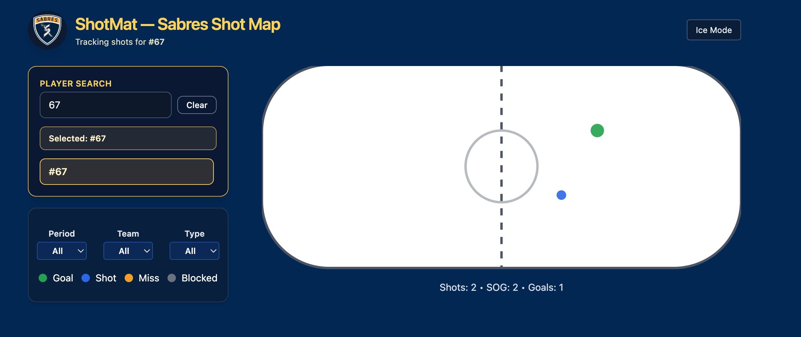

# 🏒 ShotMat — Hockey Shot Map (Sabres theme)

---

### 📍 Live Demo  
👉 **https://dkranzmat.github.io/shotmat/**

---

## 🏒 Overview

ShotMat is a fast, interactive hockey analytics tool that plots shot events on a full NHL-regulation rink.
Built as a clean front-end project, it combines:

React for interactive UI

TypeScript for strict data modeling

Tailwind CSS for fast styling

SVG-based rink rendering for pixel-perfect visuals

CSV-driven loading for real-world hockey tracking workflows

It’s built to be simple, portable, and deployable anywhere — ideal for portfolio work, coaching tools, team dashboards, or personal analytics.

---

## 🧠 Features

🎯 Shot Tracking & Visualization

Precise x/y coordinate plotting on an NHL-regulation rink

SVG-based rink for crisp rendering at any size

Color-coded markers for each shot outcome:

🟦 Shot

🟨 Miss

🟥 Goal

⬛ Blocked

🧬 Smart Filtering

Period filter (1, 2, 3, OT, or All)

Team filter (Home/Away auto-detected from CSV)

Result filter (Shot, Miss, Goal, Blocked, All)

👤 Player Tracking

Integrated PlayerPicker component

Select a player → instantly highlight only their shots

CSV-backed player matching via playerNumber

“Tracking shots for #67” header updates automatically

Perfect for youth teams, high school, travel squads, etc.

🔎 Search & Roster Integration (MiniSearch-ready)

Roster model supports name/number lookup

Live search UI is prepped and expandable

Ready for future MiniSearch fuzzy search integration

🎨 Theming Options

Sabres Mode (deep navy + gold)

Ice Mode (light UI with clean contrast)

Insta-toggle button swaps theme in real time

📦 CSV-Driven Data Pipeline

Upload or fetch a CSV (x, y, period, result, team, playerNumber…)

Automatically parsed + typed with TypeScript

New shots appear instantly without rebuilding the app

⚡ Performance & Build

Vite-powered dev server

Ultra-fast HMR

Static build deploys cleanly to GitHub Pages

Zero backend required

---

## ⚙️ Tech Stack

React + TypeScript, Vite, Tailwind CSS, SVG, D3 concepts, GitHub Pages

---

## 🚀 Getting Started

git clone https://github.com/DKranzMAT/shotmat.git  
cd shotmat  
npm install  
npm run dev  
npm run build  
npm run deploy  

---

## 📊 Example Data (`shots_sample.csv`)

| team | x | y | result |
|------|---|---|---------|
| Home | 20 | -10 | Goal |
| Away | -15 | 15 | Miss |
| Home | -5 | -5 | Shot |
| Away | 10 | 5 | Blocked |

---

## 🧑‍💻 Author

**David Kranz**  
Front-End Developer • UI Engineer  
Portfolio: https://davidkranzwordpress.com  
GitHub: https://github.com/DKranzMAT
